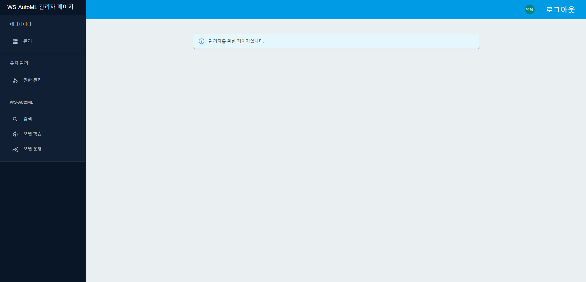
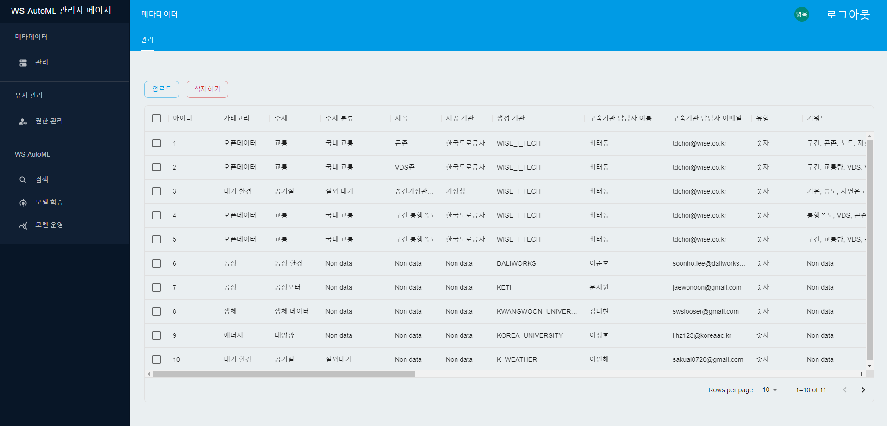
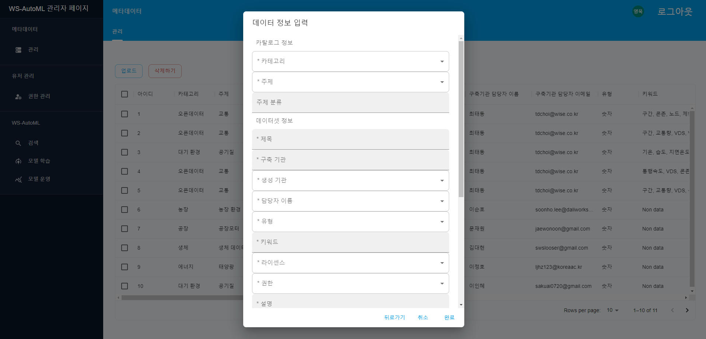

# AutoMLMainWeb

### 소개

---

WS-AutoML은 클라우드 기반의 시계열 데이터 활용을 위한 오픈 데이터 제공 및 모델 학습·활용 서비스를 제공하는 통합 데이터 관리 플랫폼입니다.

- 관리자 서비스 메인 페이지
  

### 주요 기능

---

- **관리자**

  **1) 메타데이터 관리**

  - 메타데이터 리스트
    
  - 메타데이터 업로드
    

  **2) 사용자 권한 관리**
  

### 주요 기술

---

웹

- React, Material UI, Ant Design

서버

- Java17, JUnit5
- Spring Boot, Spring Web MVC
- Spring Security, OAuth 2.0(google)
- Spring Data JPA, MariaDB, QueryDSL, Flyway, H2
- Spring Rest Docs

인프라

- Amazon RDS
- Amazon S3
- Docker, AWS ECS(EC2)
- GitHub Actions

### 기타

---

- [문서 목록](./docs)
